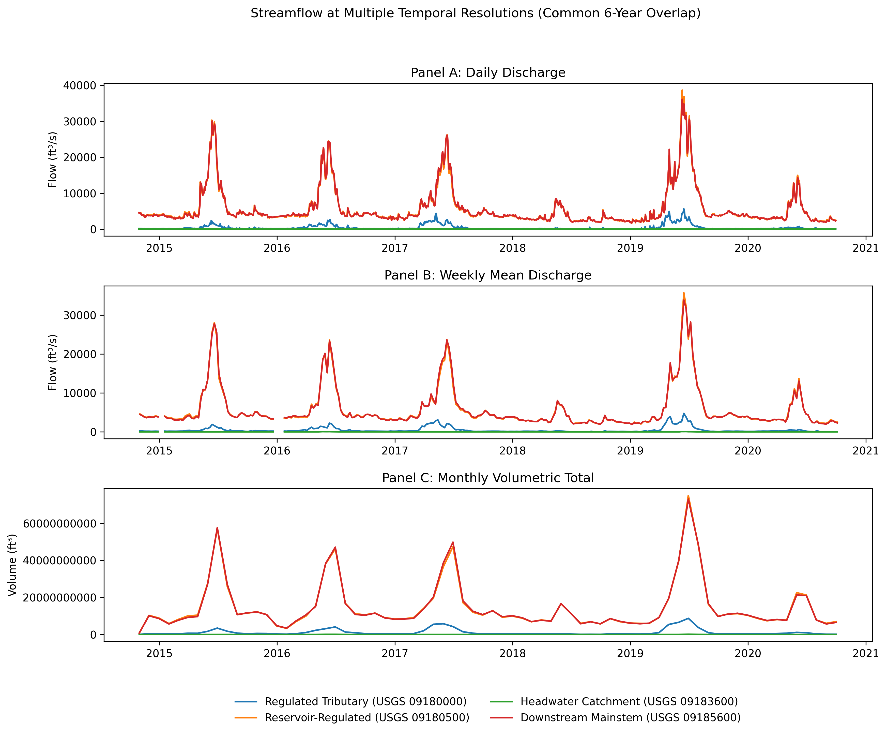
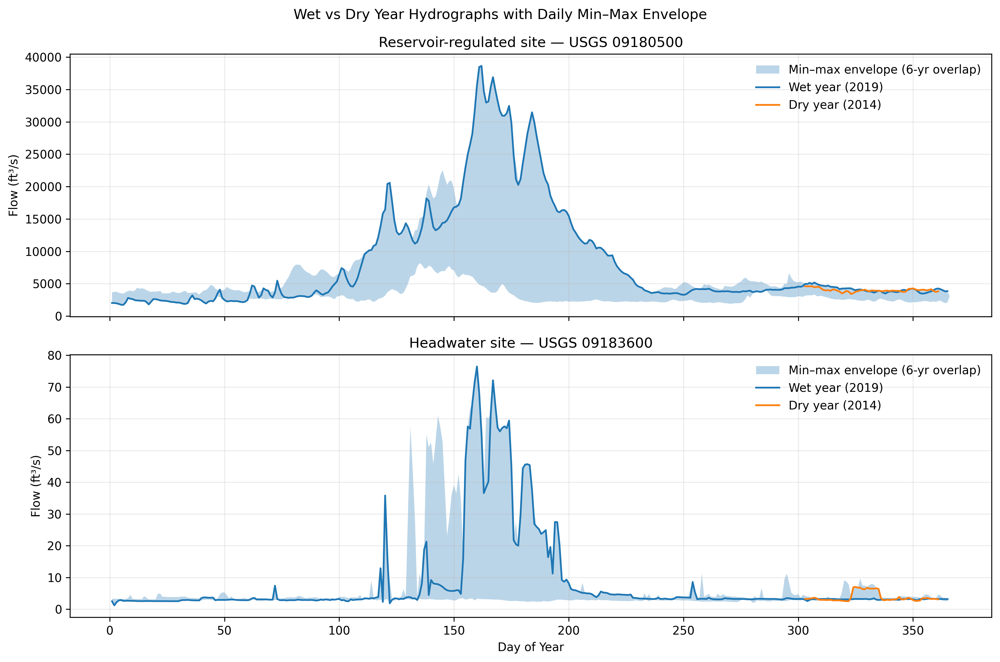

# HW1 – Time Series Streamflow Resampling

## Overview

This project analyzes daily streamflow data from four USGS gaging stations in the Upper Colorado River Basin across a common six-year period (2014–2020). The goal is to demonstrate temporal resampling at multiple scales and compare hydrologic behavior between reservoir-regulated and headwater systems.

The workflow is fully reproducible using Python, Pandas, and Matplotlib within a controlled conda environment.

---

## Study Sites

| Station ID | Name | Role |
|---|---|---|
| 09180000 | Dolores River Near Cisco, UT | Regulated Tributary |
| 09180500 | Colorado River Near Cisco, UT | Reservoir-Regulated |
| 09183600 | Mill Creek Below Sheley Tunnel, Near Moab, UT | Headwater Catchment |
| 09185600 | Colorado River at Potash, UT | Downstream Mainstem |

For comparative analysis, **USGS 09180500** (Colorado River Near Cisco) serves as the reservoir-regulated reference site and **USGS 09183600** (Mill Creek Below Sheley Tunnel) as the headwater catchment.

---

## Methods

Daily discharge data (ft³/s) were obtained from the [USGS National Water Information System (NWIS)](https://waterdata.usgs.gov/nwis). Records were loaded into Python, converted to datetime-indexed DataFrames, and subset to the shared 2014–2020 overlap period.

Temporal aggregation was performed at three scales:

- **Weekly** – mean discharge (ft³/s)
- **Monthly** – volumetric totals (ft³/month)
- **Annual** – volumetric totals (ft³/year)

Wet and dry years were identified from annual volumetric discharge totals. Daily hydrographs were grouped by day of year to construct a six-year min–max envelope, with wet and dry year traces overlaid for comparison.

All analyses were performed in a Jupyter Notebook and version-controlled with GitHub.

---

## Results

### Temporal Resampling Across Scales



Aggregating from daily to weekly to monthly scales progressively smooths the hydrograph signal. Reservoir-regulated and downstream mainstem sites show amplified seasonal peaks relative to the headwater catchment, reflecting the influence of upstream storage on flow timing and magnitude.

---

### Wet vs. Dry Year Hydrographs



Wet (2019) and dry (2014) year hydrographs are compared against the six-year daily min–max envelope. The reservoir-regulated site exhibits peak attenuation and sustained late-season flow, while the headwater site shows a sharper snowmelt pulse and faster recession — a pattern consistent with direct runoff response and minimal upstream storage.

---

## Repository Structure

```
hw1-timeseries-streamflow-resampling/
│
├── data/
│   ├── raw/                 # Raw USGS streamflow data
│   └── processed/           # Processed, overlapping 6-year dataset
│
├── notebooks/
│   └── 01_data_acquisition_processing.ipynb
│
├── figures/                 # Output figures
│
├── environment.yml          # Conda environment specification
├── .gitignore
└── README.md
```

---

## How to Reproduce

**1. Clone the repository**
```bash
git clone <your-repository-url>
cd hw1-timeseries-streamflow-resampling
```

**2. Create the conda environment**
```bash
conda env create -f environment.yml
```

**3. Activate the environment**
```bash
conda activate hw1-streamflow
```

**4. Launch Jupyter**
```bash
jupyter notebook
```

**5. Open and run the notebook**
```
notebooks/01_data_acquisition_processing.ipynb
```